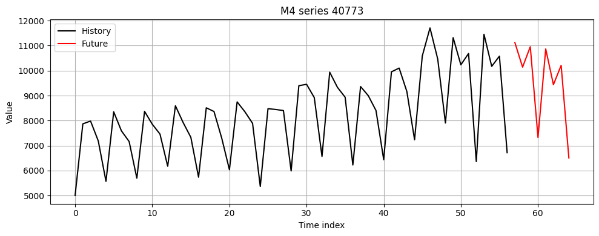

# M4comp2018py
Python version of The R package M4comp2018 contains the 100000 time series from the M4-competition. It also includes the true future values (the test part) and the submitted forecasts of the top25 participants.

---
editor_options: 
  markdown: 
    wrap: 72
---

# m4comp2018py (minimal bridge)

A minimal Python helper to access the **M4 dataset** from the
[`M4comp2018`](https://github.com/carlanetto/M4comp2018) R package,
without re-implementing the data logic in Python.

The design goal is to:

-   Keep the original **R M4 object** and its lazy structure.
-   Use **rpy2** only as a thin bridge into R.
-   Provide a clean, documented way to:
    -   download the M4comp2018 R tarball,
    -   extract `M4.rda` into a visible `data/` folder,
    -   load the `M4` object from R,
    -   inspect and filter series from Python,
    -   prepare data for downstream work (e.g. sktime, FFORMA
        benchmarking).

This is intentionally **small and explicit** so it can be used as a
reliable building block in research projects.

------------------------------------------------------------------------

## Project structure

\`\`\`text . ├── config.py \# paths and URL configuration ├── src/ │ └──
m4_loader.py \# all logic to download, extract, load, and filter M4 ├──
data/ \# created automatically; holds M4 tarball and M4.rda └──
notebooks/ └── test_m4.ipynb \# example usage and sanity checks

## Requirements

Python 3.10

A working R installation (Rscript on PATH)

Python packages:

rpy2

numpy

You can install the Python dependencies with:

pip install rpy2 numpy

## How it works

config.py defines:

the project root,

the data/ directory,

the download URL for M4comp2018_0.2.0.tar.gz,

the target path for M4.rda.

m4_loader.py provides utilities to:

download_m4_tarball() → download the R package tarball

extract_m4_rda_from_tarball() → extract M4.rda into data/

load_m4_r_object() → call R's load() and retrieve the M4 object

get_m4_series_py() → quick extraction of one series

extract_m4_series() → full extraction of one series (all fields)

filter_m4_series() → select series by period and type labels

The actual data stays in R as much as possible; Python only pulls what
is needed for a given experiment.
